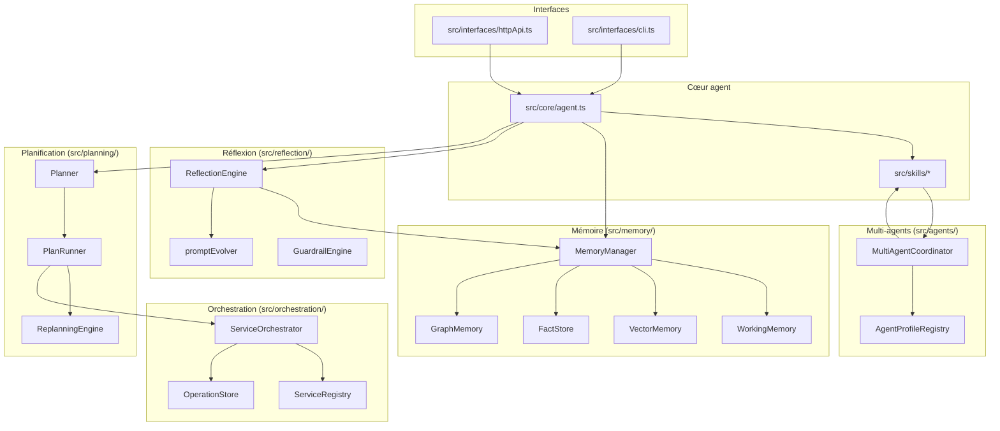
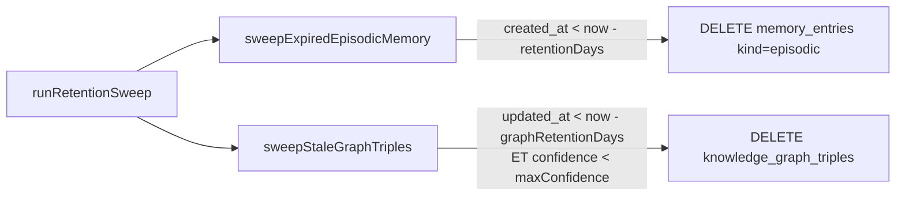
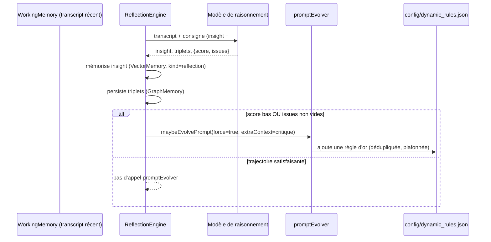
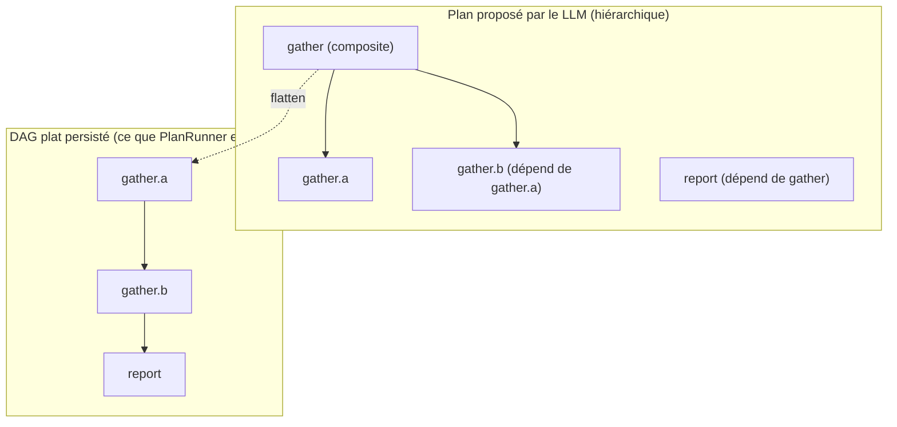
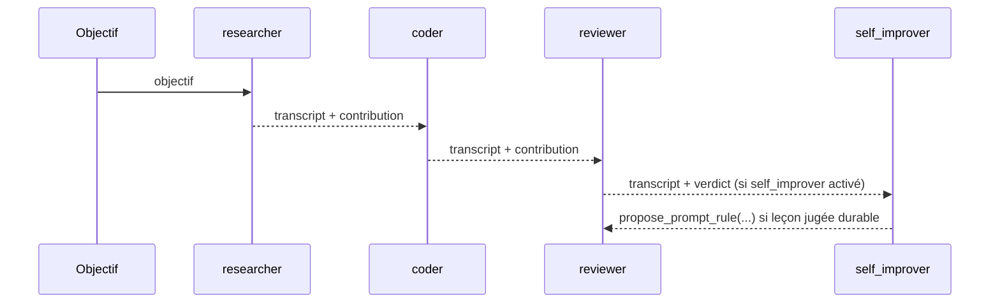

# Architecture

Ce document complète le [README](./README.md) (les "9 briques" + ce qui va
au-delà) par une vue plus profonde de l'architecture réelle du dépôt, et sert
de journal pour les évolutions de fond (pas les correctifs ponctuels). Il
documente l'état constaté du code au moment de sa rédaction — à mettre à jour
si l'architecture change, pas à considérer comme une spécification figée.

## 1. Carte des modules

`MemoryManager` est la façade unique déjà présente dans le code — elle joue
le rôle que d'autres architectures nomment "Memory Orchestrator" (CrewAI,
Letta) : un seul point d'entrée pour `retrieve()`/`recordTurn()`, quatre
stores spécialisés en interne. Cette session a renforcé sa politique de
rétention plutôt que de la remplacer par une nouvelle classe : le nom
`MemoryManager` reste, le rôle "orchestrateur" existait déjà.

## 2. Rétention mémoire cross-store

Avant cette session, seule la mémoire épisodique (vectorielle) avait une
politique de rétention (`config.projects.memoryRetentionDays`, purge par
ancienneté). Le graphe de connaissances (`GraphMemory`) n'avait aucun TTL —
un triplet halluciné à faible confiance restait indéfiniment.

`src/memory/retentionSweeper.ts` expose maintenant un point d'entrée unique,
`runRetentionSweep()`, avec une politique différenciée par store :

Points clés :
- Un triplet **régulièrement renforcé** (revu par `ReflectionEngine`, donc
  `updated_at` rafraîchi) ne s'use jamais, même ancien.
- Un triplet **à haute confiance** ne s'use jamais, même vieux et non revu —
  la connaissance établie n'a pas de date de péremption, contrairement à un
  tour de conversation brut.
- Désactivé par défaut (`config.memory.graphRetentionDays = 0`) : aucun
  changement de comportement pour les déploiements existants tant que la
  variable d'environnement `MEMORY_GRAPH_RETENTION_DAYS` n'est pas définie.
- Les faits (`FactStore`, clé `(entité, attribut) -> valeur`) et la mémoire
  de travail (`WorkingMemory`, cache borné en process) n'ont délibérément
  pas de sweep : le premier n'a qu'une valeur courante par clé (déjà
  "unifié" par construction, un `UPSERT` écrase l'ancienne valeur), la
  seconde n'est jamais persistée en base.

## 3. Auto-critique structurée (ReflectionEngine)

`ReflectionEngine.createInsight()` demandait déjà au modèle de raisonnement
un résumé (insight) et un bloc de triplets factuels dans le même appel LLM
(`###TRIPLES###`). Cette session ajoute un troisième bloc, `###CRITIQUE###`,
qui fait de la réflexion périodique un vrai self-critique plutôt qu'un
simple résumé :

Avant cette session, `promptEvolver` ne se déclenchait que sur un pattern
regex très spécifique (`/Erreur outil /i`, une correction de self-healing).
Le score d'auto-critique élargit ce déclenchement à tout ce que le modèle
lui-même juge insatisfaisant, même sans erreur d'outil explicite — un pas
vers la boucle "reflection → critique → apprentissage" visée par la
demande initiale, sans réécrire l'existant : le chemin regex reste actif en
parallèle (comportement historique préservé pour tous les appels existants
qui n'émettent pas de bloc `###CRITIQUE###`, par exemple tous les tests déjà
en place).

Nouveau, également : un agent d'une AgentTeam peut désormais proposer
explicitement une règle via le skill `propose_prompt_rule`
(`src/skills/builtin/proposePromptRule.ts`), avec la même politique de
déduplication/plafond — voir §5.

## 4. Décomposition hiérarchique du planner

Le planner persistait déjà un plan comme un DAG (dépendances entre
`local_id`, pas seulement un arbre parent/enfant), avec replanification,
snapshots et rollback. Ce qui manquait : la possibilité, pour le LLM qui
propose le plan initial (skill `execute_mission`), de déclarer qu'une étape
est en réalité composée de sous-étapes — sans que `PlanRunner` (l'exécuteur)
ait quoi que ce soit à connaître de cette hiérarchie.

`flattenHierarchicalSteps()` (`src/planning/planner.ts`) aplatit
l'arborescence **avant** persistance : un step portant `sub_steps` n'est
jamais lui-même exécuté, il est remplacé par ses descendants, et toute
étape qui en dépendait dépend désormais de la "frontière" de sa
sous-arborescence (les feuilles dont aucune autre feuille interne ne
dépend).

`PlanRunner`, `ReplanningEngine` et le modèle de dépendances DAG existant
n'ont pas changé d'une ligne : le flatten se fait entièrement dans
`validatePlanSteps()`, en amont. Un plan déjà plat (sans `sub_steps`, le cas
historique) traverse ce chemin sans aucun changement observable — vérifié
par les tests existants (`plannerRollback.test.ts`, `planRunner.test.ts`).
Profondeur bornée à 3 niveaux (`MAX_DECOMPOSITION_DEPTH`) et nombre total
d'étapes exécutables toujours plafonné par `maxSteps`, décomposition
comprise.

## 5. AgentTeam : rôles spécialisés

`MultiAgentCoordinator` (`src/agents/multiAgentCoordinator.ts`) est déjà
l'équivalent local d'une équipe CrewAI/AutoGen : des profils déclaratifs
(`config/agent-profiles.json`), chacun avec son propre `LLMProvider` (via
`providerForRole`), son prompt système et un pool de compétences restreint,
collaborant en séquence sur un transcript partagé, avec reprise après
crash (`AgentTeamStore`).

Le fichier d'exemple ne portait que deux rôles (Chercheur, Développeur).
Cette session ajoute les deux rôles de gouvernance qui manquaient :

| Rôle | Déclenché | Compétences | Effet |
|---|---|---|---|
| `reviewer` | activé par défaut | `knowledge_search` | Relit la contribution des agents précédents, signale affirmations non vérifiées/incohérences, sans droit d'écriture — pur contrôle qualité en fin de pipeline. |
| `self_improver` | désactivé par défaut | `propose_prompt_rule` | Dernier maillon optionnel : identifie une leçon générale et l'ajoute durablement via le nouveau skill `propose_prompt_rule`, avec la même politique de dédup/plafond que `promptEvolver`. Désactivé par défaut car il a un effet de bord (écriture disque) — et de toute façon inactif tant que `config.promptEvolution.enabled` reste `false` (défaut). |

Les rôles "Planner"/"Executor" demandés dans la spécification initiale
existent déjà dans le socle, mais à un autre niveau que l'AgentTeam : c'est
exactement ce que font `Planner`/`PlanRunner`/`ServiceOrchestrator` (§4),
un mécanisme différent et déjà plus robuste (DAG persisté, replanification,
rollback) qu'un simple profil de prompt. Les dupliquer comme profils
d'AgentTeam aurait ajouté une deuxième notion de "plan" concurrente de la
première, sans bénéfice — non fait volontairement.

## 6. Comparaison avec l'état de l'art (qualitative)

Comparaison honnête, sans chiffre de performance inventé — aucun benchmark
n'a été exécuté sur ce dépôt face à ces frameworks.

| Capacité | Ce dépôt | CrewAI | AutoGen | LangGraph |
|---|---|---|---|---|
| Plan = DAG persisté avec replanification/rollback | Oui (`Planner`/`PlanRunner`, snapshots) | Non (séquentiel/hiérarchique simple) | Partiel (conversations, pas de DAG persisté) | Oui (graphe d'états, plus générique) |
| Décomposition hiérarchique compilée en DAG | Oui (nouveau, §4) | Non | Non | Oui (nativement, plus flexible) |
| Mémoire multi-couche (épisodique/vectorielle/faits/graphe) unifiée | Oui (`MemoryManager`) | Partiel (mémoire courte + RAG) | Non (externe à la lib) | Non (laissé à l'implémenteur) |
| Rétention différenciée par store avec TTL | Oui (nouveau, §2) | Non | Non | Non |
| Auto-critique structurée + apprentissage de règles | Oui (nouveau, §3) | Non | Non (nécessite code custom) | Non (nécessite code custom) |
| Équipe de rôles spécialisés avec reprise après crash | Oui (`MultiAgentCoordinator` + `AgentTeamStore`) | Oui (mémoire de crew, moins durable) | Oui (conversation persistée) | Oui (checkpointer natif) |
| Sandbox d'exécution de code isolée (Docker/E2B) | Oui (`src/execution/`) | Non nativement | Oui (code executors) | Non nativement |

Ce que ce dépôt n'a **pas** et que LangGraph a nativement : un moteur de
graphe d'états généraliste (n'importe quelle topologie, pas seulement un
DAG de capacités) et un écosystème de checkpointers pluggables. Le choix
fait ici (DAG spécialisé "mission/étape/capacité" plutôt que graphe d'états
générique) est délibéré et documenté dans le code (`planner.ts`), pas un
oubli.

## 7. Ce qui reste (hors scope de cette session)

Cette session a traité une tranche scopée et testée de la "Phase 1"
(mémoire, réflexion, planificateur, AgentTeam). Restent hors scope, à
traiter comme des chantiers séparés plutôt qu'en un seul passage :

- `ModelRouter` multi-fournisseurs avec priorisation par capacité/coût
  (au-delà du routage par rôle déjà existant, `src/llm/modelRouter.ts`).
- Persistent agents "always-on" avec état durable façon Temporal
  (au-delà de la reprise déjà existante — `AgentTeamStore.incomplete()`,
  checkpoints de plan).
- Extension du support MCP au-delà de la configuration actuelle
  (`config/mcp-servers.json`).
- `repositoryIntelligenceEngine.ts` : approfondir la compréhension inter-
  fichiers (dépendances, graphe d'imports) au-delà de la lecture/recherche
  actuelle.

## 8. Chevauchements architecturaux identifiés par l'audit Skills & Capabilities

`src/coordination/gapAnalysis.ts#KNOWN_ARCHITECTURAL_OVERLAPS` (chantier
Skills & Capabilities, PR #90) liste 3 chevauchements constatés qu'aucun
croisement programmatique ne peut détecter seul (noms différents, même
rôle). Le verdict y est volontairement `UNKNOWN` — "ne supprime rien
automatiquement sans preuve que c'est inutilisé" — un humain tranche. Cette
section documente chacun et propose une résolution, sans trancher : le
`verdict` dans `gapAnalysis.ts` reste `UNKNOWN` tant que William n'a pas
validé l'une des options ci-dessous.

### 8.1 Deux instances `TaskStore` indépendantes sur la même table SQLite

`src/skills/builtin/tasks.ts` instancie un `TaskStore` module-level
(`create_task`/`list_tasks`/`complete_task`) et `src/skills/runtime.ts#createRuntimeSkills`
en instancie un second (`schedule_task`/`monitor_condition`/`inspect_task`/
`cancel_task`). Les deux pointent vers la même table SQLite (`tasks`,
`src/tasks/taskStore.ts`) — donc pas de divergence de données entre les
deux familles de skills — mais exposent au LLM deux surfaces différentes
pour manipuler le même concept, avec un risque de confusion sur laquelle
utiliser pour quel besoin.

**Proposition** : `MERGE` — fusionner les deux familles de skills sous un
seul jeu d'actions porté par une seule instance de `TaskStore` injectée
(comme `repositoryClient`/`vectorMemory` le sont déjà dans
`createRuntimeSkills`), au lieu de deux instanciations indépendantes.
Risque faible (même backing store, donc pas de migration de données) mais
touche la surface de tool-calling exposée au LLM — à valider par William
avant d'y toucher, et à traiter comme un chantier dédié (pas un side-effect
d'une autre PR).

### 8.2 Trois alias de type portant le même ensemble de valeurs

`src/orchestration/contract.ts#RiskLevel`, `src/types.ts#SkillRisk` et
`src/types.ts#PendingActionRisk` sont trois `type` distincts, tous égaux à
`"LOW" | "MEDIUM" | "HIGH" | "CRITICAL"`. Aucune divergence de valeur
constatée à ce jour — le risque est une dérive future si l'un des trois est
étendu (ex. ajout de `"NONE"`) sans les deux autres, ce qui romprait
silencieusement l'interopérabilité entre modules qui se passent un risque
d'un contrat à l'autre.

**Proposition** : `MERGE` — garder `RiskLevel` (`src/orchestration/contract.ts`)
comme unique source de vérité (c'est déjà le nom le plus générique et le
plus utilisé transversalement) et faire de `SkillRisk`/`PendingActionRisk`
des ré-exports (`export type SkillRisk = RiskLevel`) plutôt que des
définitions dupliquées. Risque très faible (signature de type identique
aujourd'hui, changement mécanique), mais volontairement laissé hors de
PR-G/PR-M pour respecter la règle "une PR par sujet" — chantier séparé et
trivial à vérifier (le compilateur TypeScript signale immédiatement tout
site d'usage incompatible).

### 8.3 Pipeline Reviewer Gate : les deux moitiés existent, rien ne les relie encore en production

`src/repository/githubReadOnlyClient.ts#getCiStatus`/`getMainProtectionStatus`
(lecture réelle GitHub) et `src/coordination/contracts.ts#AuditPacketInput`
(contrat de preuves attendu par le Reviewer, avec un champ `ci: CiStatusResult`
non optionnel) sont chacun testés isolément, mais aucun appelant en
production ne construit encore d'`AuditPacket` réel à partir d'un appel
`getCiStatus` — confirmé par une recherche exhaustive de `buildAuditPacket`/
`buildReviewerVerdict` dans le dépôt : les seuls appelants sont
`src/coordination/contracts.test.ts`. `src/services/softwareFactoryService.ts`
(le pipeline de chantier réel) ne référence ni `AuditPacket` ni
`ReviewerVerdict` du tout. Ce n'est pas un doublon à fusionner : c'est
l'intégration manquante que la tâche 3 de ce brief (PR-I, "intégrer un vrai
build/test dans le pipeline de fusion") est censée combler — cf. incident
PR #83 (pipeline ne lance pas `npm run build`/`npm test` avant verdict).

**Proposition** : pas de verdict de déduplication ici (ce n'est pas un
chevauchement au sens strict, les deux moitiés ont des responsabilités
distinctes et complémentaires) — la résolution est le câblage lui-même,
scope de PR-I : appeler `getCiStatus`/`getMainProtectionStatus` au bon
moment du pipeline, peupler `AuditPacketInput.ci`/`mainProtection`, et
bloquer `GO_FUSION` si le statut agrégé n'est pas `success`
(`buildReviewerVerdict` refuse déjà `GO_FUSION` si `ci.overallState !==
"success"` — la logique de refus existe, seule l'alimentation en données
réelles manque). PR-I n'a pas été traitée dans la même session que ce
document (chantier de pipeline substantiel, à vérifier avec un scénario
CI-rouge reproduit puis corrigé avant toute PR, pas seulement une
affirmation) — voir le suivi séparé.

## 9. Reviewer Gate (tâches 3/4 du brief JARVIS-00) : questions ouvertes avant implémentation

Recherche menée pour tenter d'implémenter la tâche 3 ("intégrer un vrai
build/test dans le pipeline de fusion") : le câblage n'a **pas** été fait
dans cette session, parce que la recherche a mis au jour une ambiguïté
d'architecture réelle qui dépasse le code — exactement le cas où la règle
absolue n°6 du brief ("documenter et proposer, laisser la décision finale
à William") s'applique. Ce qui suit est un compte-rendu factuel de ce qui
existe, pas une proposition d'implémentation à l'aveugle.

### Constat : deux pipelines distincts, ni l'un ni l'autre n'a de Reviewer Gate câblé

**Pipeline A — Software Factory déclenchée par l'agent** (`src/services/
softwareFactoryService.ts#executeWorkflow`, skill `software_development`) :
c'est le pipeline réellement actif aujourd'hui — c'est lui qui a produit
chaque PR "[Jarvis Software Factory] Patch for X". Il authentifie, lit le
fichier, génère le code, passe le secret guard et le diff-fidelity control,
crée la branche/le commit, **ouvre la PR, et retourne immédiatement** — sans
attendre la CI (qui ne démarre qu'après l'ouverture de la PR) ni appeler
aucun "auditeur". `diffFidelity` est déjà calculé et disponible dans cette
fonction au moment du retour ; `ci`/`mainProtection` n'y sont jamais lus.
Ce pipeline n'a ni `missionId` ni `traceId` ni `ContextVersion` — juste un
`taskId` simple.

**Pipeline B — Mission JARVIS-00 orchestrée par n8n** (`src/coordination/
missionStore.ts` + `callbackTransport.ts`) : `AuditPacketInput` (`contracts.ts`)
exige `missionId`/`traceId`/`ContextVersion` — des concepts qui n'existent
que dans ce pipeline-ci, jamais dans le Pipeline A. `CALLBACK_EVENT_TYPES`
inclut déjà `CI_STATUS_UPDATE` et `BUILD_RESULT` : le transport est conçu
pour recevoir un statut CI/build d'une source externe (n8n ?) et le
journaliser sur une mission. Mais **rien ne consomme ces événements
journalisés** pour construire un `AuditPacket` ou produire un
`ReviewerVerdict` — confirmé par une recherche exhaustive de
`buildAuditPacket`/`buildReviewerVerdict` dans tout le dépôt : les seuls
appelants sont `src/coordination/contracts.test.ts`. `processCallback()`
journalise, point final ("Aucune logique de fusion GitHub n'existe dans ce
module", docstring de `callbackTransport.ts`).

Dans les deux cas, **aucun "auditeur" LLM qui lit un diff et rend un avis
n'existe nulle part dans le dépôt** (recherche exhaustive de "auditor" /
"reviewer" / "audit" côté LLM — rien trouvé hors le rôle `Reviewer` de
`AgentTeam`, un système multi-agents sans rapport). La tâche 4 du brief
("enrichir le contexte de l'auditeur au-delà du diff seul") présuppose un
auditeur diff-only déjà existant à corriger — il n'existe pas encore à
construire d'abord, donc les tâches 3 et 4 doivent en réalité être conçues
ensemble, pas en deux passages séquentiels indépendants.

### Pourquoi ce n'est pas un simple "appeler getCiStatus au bon endroit"

`buildReviewerVerdict()` refuse déjà `GO_FUSION` si `ci.overallState !==
"success"` — la logique de refus (critère d'acceptation de la tâche 3) est
déjà écrite et testée (`contracts.test.ts`). Ce qui manque n'est donc pas
cette logique, mais : (a) un point d'entrée qui construise un `AuditPacket`
réel avec un `getCiStatus` réel, et (b) le fait que la CI n'existe pas
encore au moment où le Pipeline A ouvre la PR — il n'y a rien à lire avant
que GitHub Actions ait eu le temps de tourner (quelques minutes, observé
sur ce dépôt : ~1-5 min selon le job).

### Options pour combler ce gap (aucune tranchée ici)

1. **Câbler dans le Pipeline A, en différé.** Ajouter une étape séparée
   (nouvelle action de skill, ou tâche planifiée via `schedule_task`/
   `monitor_condition` déjà existants) qui, après l'ouverture de la PR,
   attend/sonde la CI jusqu'à complétion (borné, le timeout du skill
   `software_development` est déjà de 600000ms) puis construit le verdict.
   Nécessite de décider : `missionId`/`traceId` fabriqués à partir de
   `taskId`, ou `AuditPacketInput` étendu (composition, jamais redéfini —
   règle absolue n°2) pour rendre ces champs optionnels hors contexte
   mission. Où le verdict est-il rendu visible ? (commentaire sur la PR
   GitHub, la seule surface que William regarde déjà pour approuver.)
2. **Câbler dans le Pipeline B (mission n8n).** Ajoute un consommateur des
   `MissionEvent` `CI_STATUS_UPDATE`/`BUILD_RESULT` déjà journalisés, qui
   construit l'`AuditPacket` et produit le verdict. Colle exactement au
   contrat existant (`missionId`/`traceId` déjà là) mais suppose que ce
   pipeline externe est réellement utilisé aujourd'hui — à confirmer, aucun
   workflow n8n n'est présent dans ce dépôt pour le vérifier.
3. **Construire l'auditeur LLM avant tout câblage CI.** Sans lui, le
   critère d'acceptation de la tâche 3 ("REFUS_FUSION même si l'auditeur
   n'a rien trouvé de gênant") ne peut pas être démontré — il faut un
   auditeur pour observer qu'il n'a "rien trouvé de gênant". Implique de
   choisir : quel `LLMProvider` l'exécute, avec quel prompt, sur quel
   déclencheur, avec quelle preuve de non-régression (le risque PR #81 —
   faux positif par manque de contexte — vise directement ce composant).

**Recommandation, sans trancher** : l'option 1 est la seule qui touche un
pipeline réellement actif aujourd'hui. Construire l'auditeur (item 3) est un
prérequis technique aux deux options, pas une tâche 4 séparée qui suivrait
une tâche 3 déjà posée — les deux devraient être conçues comme un seul
chantier (PR-I+PR-J fusionnées), pas deux PR séquentielles indépendantes.
Avant d'écrire du code sur ce chantier, la question à trancher par William :
quel pipeline (A, B, ou les deux) ce Reviewer Gate doit-il réellement
gouverner, et où le verdict doit-il apparaître pour qu'un humain le voie ?
